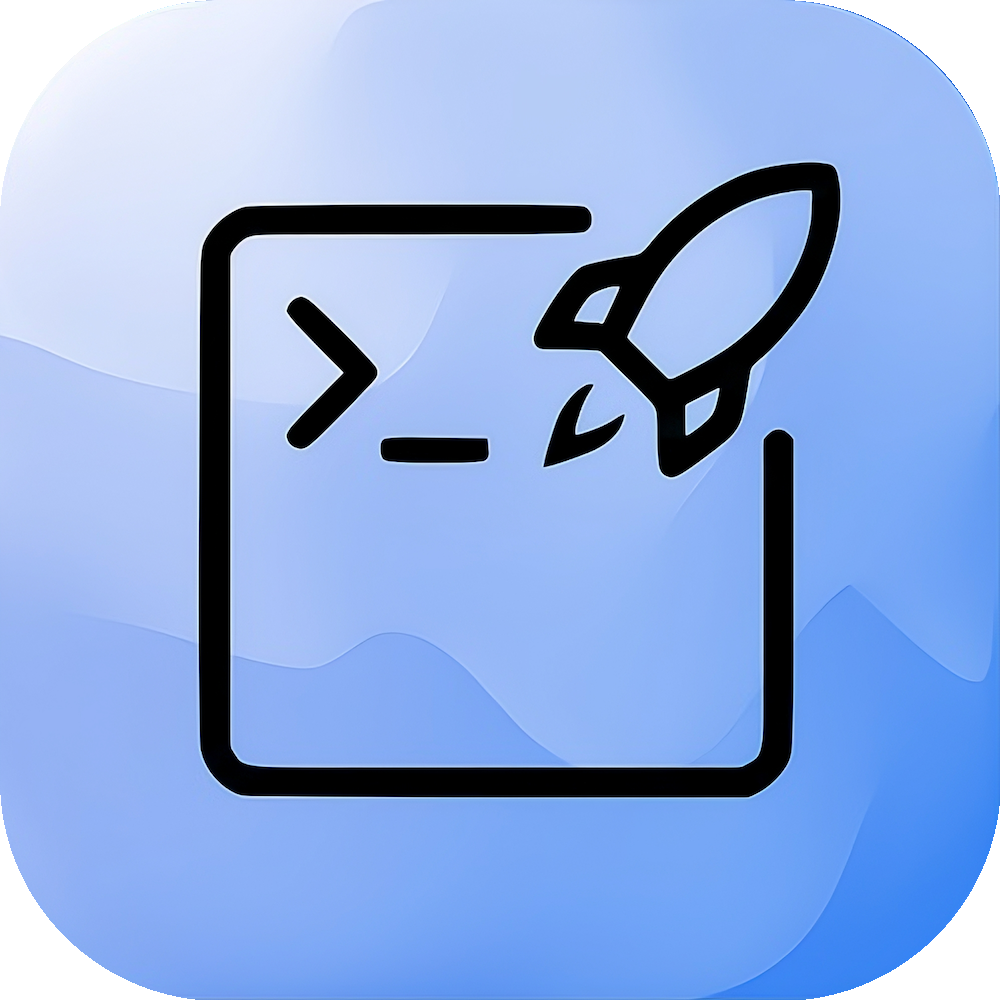

<p align="center">
    
</p>

# TermLaunch

## About

A lightweight macOS menu bar utility to quickly open your favorite terminal application.

## Features

- **Menu bar icon**: Quick access from anywhere with a click
- **Global hotkey**: Press `⌥ Space` (Option + Space) to open the terminal instantly
- **Multiple terminal support**: Choose from Terminal, iTerm, Ghostty, Warp, or Kitty
- **Persistent selection**: Your terminal preference is saved between launches
- **Minimal footprint**: Runs as an accessory app in the menu bar

## Installation

### Build and Install from Source

1. Clone the repository:

   ```bash
   git clone https://github.com/MehmetMHY/TermLaunch.git
   cd TermLaunch
   ```

2. Run the install script:

   ```bash
   ./install.sh
   ```

Alternatively, if you want to build without installing:

```bash
./build.sh
./install.sh -r
```

Or manually open the app:

```bash
./build.sh
open ./build/TermLaunch.app
```

### Start at Login

To have TermLaunch automatically open when you log in:

1. Open **System Settings** (or System Preferences)
2. Go to **General** → **Login Items**
3. Click the **+** button under "Open at Login"
4. Navigate to `/Applications` and select **TermLaunch.app**
5. Click **Add**

TermLaunch will now automatically start whenever you log in.

## Usage

### Via Menu

Click the app's menu bar icon to open the menu:

- **Shortcut: ⌥ Space**: Shows the hotkey for quick reference
- **Open**: Opens your selected terminal
- **Terminal**: Submenu to select which terminal to use
- **Quit**: Close the app

### Via Hotkey

Press `⌥ Space` (Option + Space) at any time to instantly open your selected terminal.

### Select Your Terminal

1. Click the menu bar icon
2. Hover over "Terminal"
3. Select your preferred terminal:
   - Terminal (macOS)
   - iTerm
   - Ghostty
   - Warp
   - Kitty

## Requirements

- macOS 12.0 or later
- Swift compiler (included with Xcode)

## Building

The project uses Swift and compiles with the system frameworks:

- Cocoa: macOS user interface
- Carbon: For global hotkey support

To build it run the following command:

```bash
./build.sh
```

This will create `build/TermLaunch.app`.

### Generating App Icon

To regenerate the app icon from `logo.png` using the `generate_icon.py` script:

1. First, install the Python dependencies from `requirements.txt`:

```bash
python3 -m venv .venv
source .venv/bin/activate
pip3 install -r requirements.txt
```

2. Then run the icon generation script:

```bash
python3 generate_icon.py
```

This creates an `AppIcon.icns` file with all required macOS icon sizes and proper padding. The icon is automatically included in the build process.

## Uninstalling

To uninstall TermLaunch from `/Applications`:

```bash
./install.sh -u
# or
./install.sh --uninstall
```

To reinstall after uninstalling:

```bash
./install.sh -u && ./install.sh
```

## License

This project is licensed under the MIT License. See the [LICENSE](LICENSE) file for details.
